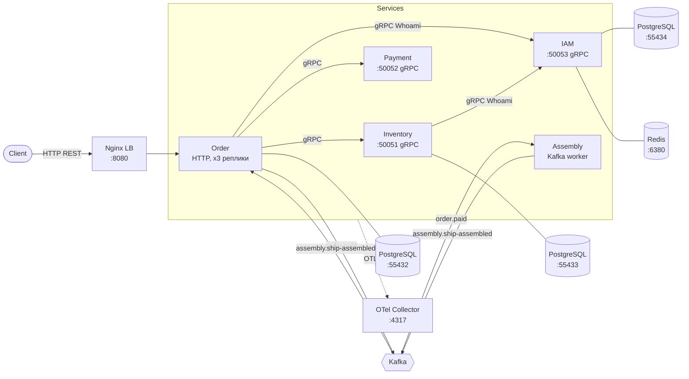

# Rocket Factory 🚀


Учебный проект микросервисной архитектуры на Go: «завод по сборке космических кораблей».
Пользователь регистрируется, создаёт заказ из набора деталей, оплачивает его — после чего корабль
асинхронно собирается, а статус заказа обновляется через события Kafka.

Репозиторий построен как **Go workspace** (`go.work`) из независимых модулей: пять сервисов,
общая платформенная библиотека и общие контракты API.

---

## Архитектура



### Сервисы

| Сервис        | Протокол        | Порт  | Хранилище                  | Назначение                                                                   |
|---------------|-----------------|-------|----------------------------|------------------------------------------------------------------------------|
| **order**     | HTTP (OpenAPI)  | 8080  | PostgreSQL `:55432`        | Создание, получение, оплата и отмена заказов; оркестрация остальных сервисов  |
| **inventory** | gRPC            | 50051 | PostgreSQL `:55433`        | Каталог деталей, проверка совместимости, резервирование/коммит/освобождение   |
| **payment**   | gRPC            | 50052 | —                          | Проведение оплаты заказа                                                     |
| **iam**       | gRPC            | 50053 | PostgreSQL `:55434`, Redis | Регистрация, логин, сессии, `Whoami` для остальных сервисов                   |
| **assembly**  | Kafka consumer  | —     | —                          | Асинхронная «сборка корабля» по событию оплаты                                |

В контейнерном режиме (`task up-all`) Order поднимается в трёх репликах за Nginx на `:8080`,
а входящий HTTP-трафик ограничивается распределённым rate limiter'ом на Redis
(`redis-ratelimit:6379`, по умолчанию 100 rps при burst 200).

Вспомогательные модули:

- **platform** — переиспользуемая инфраструктура: логгер, трейсинг, метрики, Kafka producer/consumer,
  Redis-клиент, graceful shutdown (`closer`), gRPC health, auth-контекст, middleware.
- **shared** — контракты: `.proto` (gRPC), OpenAPI-спека Order API и сгенерированный по ним Go-код.

### Бизнес-поток

1. `POST /api/v1/orders` — Order проверяет сессию в IAM, валидирует совместимость деталей
   и резервирует их в Inventory. Заказ переходит в `PENDING_PAYMENT`.
2. `POST /api/v1/orders/{uuid}/pay` — в одной транзакции (с блокировкой заказа `SELECT ... FOR UPDATE`)
   Order вызывает Payment, переводит заказ в `PAID` и публикует событие `order.paid` в Kafka.
3. **Assembly** читает `order.paid`, «собирает корабль» и публикует `assembly.ship-assembled`.
4. Order-консьюмер читает `assembly.ship-assembled`, коммитит резерв деталей в Inventory
   и переводит заказ в `ASSEMBLED` (идемпотентно — повторные сообщения игнорируются).
5. `POST /api/v1/orders/{uuid}/cancel` — отмена заказа с освобождением резерва (`CANCELLED`).

Аутентификация сквозная: клиент передаёт токен сессии, Order-middleware и gRPC-интерсепторы
пробрасывают его дальше по цепочке вызовов, каждый сервис валидирует сессию через IAM.

---

## Стек

- **Go 1.26**, multi-module workspace
- **gRPC** + Protocol Buffers (`buf`, `protoc-gen-go`, `protoc-gen-go-grpc`)
- **OpenAPI 3** → Go-код через [`ogen`](https://github.com/ogen-go/ogen)
- **PostgreSQL** + миграции [`goose`](https://github.com/pressly/goose)
- **Redis** — кэш и хранилище сессий IAM, а также распределённый rate limiter Order API
- **Nginx** — балансировка HTTP-трафика между репликами OrderService
- **Kafka** (KRaft, без ZooKeeper) — асинхронные события
- **OpenTelemetry** → OTel Collector → Jaeger (трейсы), Prometheus + Grafana (метрики),
  Elasticsearch + Kibana (логи)
- **Docker Compose** для локальной инфраструктуры, **Task** ([go-task](https://taskfile.dev)) вместо Makefile
- **mockery**, **testify**, **testcontainers** — тестирование; **vegeta** — нагрузочные тесты
- **golangci-lint**, **gofumpt**, **gci** — качество кода

---

## Структура репозитория

```
.
├── assembly/          # сервис сборки (Kafka consumer + producer)
├── iam/               # сервис аутентификации и пользователей
├── inventory/         # сервис каталога деталей
├── order/             # сервис заказов (HTTP API, оркестратор)
├── payment/           # сервис оплаты
├── platform/pkg/      # общая инфраструктура (logger, tracing, metrics, kafka, redis, closer...)
├── shared/
│   ├── proto/         # .proto-контракты (auth, user, inventory, payment, events, common)
│   ├── api/           # OpenAPI-спека Order API
│   └── pkg/           # сгенерированный Go-код
├── migrations/        # SQL-миграции по сервисам (goose)
├── deploy/
│   ├── compose/       # docker-compose: core, observability, order, inventory, iam, services
│   ├── dockerfiles/   # образы сервисов + migrator.Dockerfile (goose)
│   ├── nginx/         # конфигурация load balancer'а перед OrderService
│   ├── grafana/       # provisioning и дашборды
│   └── otel/          # конфигурация OTel Collector
├── .github/workflows/ # CI: build, lint, unit / api / e2e тесты
└── Taskfile.yaml      # все команды проекта
```

Каждый сервис следует единой структуре:

```
<service>/
├── cmd/               # точка входа
├── internal/
│   ├── app/           # сборка приложения и DI-контейнер
│   ├── api/           # транспортный слой (gRPC / HTTP handlers) + конвертеры
│   ├── service/       # бизнес-логика
│   ├── repository/    # доступ к данным + конвертеры record ↔ model
│   ├── client/        # gRPC-клиенты к другим сервисам
│   ├── model/         # доменные модели
│   ├── config/        # конфигурация (env + yaml)
│   └── errors/        # доменные ошибки
└── config.{local,staging,production}.yaml
```

---

## Быстрый старт

Требования: Go 1.26+, Docker, [Task](https://taskfile.dev/installation/).

### Вариант 1 — всё в контейнерах

```bash
task setup           # инструменты разработки (buf, ogen, golangci-lint, gofumpt, gci)
task hooks:install   # pre-commit hook: формат + линтер (один раз на клон)
task up-all          # core + observability + БД с миграциями + сервисы за Nginx (order ×3)
```

`up-all` поднимает БД до healthy и прогоняет одноразовые `migrator-*` контейнеры (goose),
так что миграции накатываются сами. Observability тоже готовится автоматически внутри `up-core`
(`observability:init`): index template для логов в Elasticsearch, Data View в Kibana и ожидание Jaeger —
руками после `up-all` запускать нечего.

### Вариант 2 — инфраструктура в контейнерах, сервисы локально (режим разработки)

```bash
task setup
task up-infra        # Kafka + Kafka UI, observability, Redis, PostgreSQL всех сервисов + миграции

# сервисы — каждый в своём терминале или в run-конфигурации IDE
task run:iam         # :50053
task run:inventory   # :50051
task run:payment     # :50052
task run:order       # :8080
task run:assembly    # Kafka worker
```

`up-infra` поднимает всё, кроме самих сервисов: Nginx и контейнеры сервисов не запускаются,
порты `8080`, `50051`–`50053` остаются свободными для локальных процессов.

Из IDE сервис запускается как `go run ./cmd` с рабочей директорией в каталоге сервиса —
это важно, потому что `main()` подхватывает `<service>/<service>.env` относительно неё,
а конфиг по умолчанию берётся из `config.local.yaml` рядом. Другой профиль конфига —
через `CONFIG_PATH=config.staging.yaml` или флаг `-config`.

Остановить: `task down-infra` (или `task down-all`, если поднимали и контейнерные сервисы).

### Точки доступа

| Что                  | URL                                              |
|----------------------|--------------------------------------------------|
| Order API (за Nginx) | http://localhost:8080/api/v1/orders              |
| Kafka UI             | http://localhost:8090                            |
| Jaeger (трейсы)      | http://localhost:16686                           |
| Grafana (метрики)    | http://localhost:3000 — `admin` / `admin`        |
| Prometheus           | http://localhost:9090                            |
| Kibana (логи)        | http://localhost:5601                            |
| Elasticsearch        | http://localhost:9200                            |

---

## Команды разработки

Полный список — `task --list`.

### Кодогенерация

```bash
task gen              # весь сгенерированный код (proto + openapi)
task proto:gen        # Go-код из .proto
task ogen:gen         # Go-код из OpenAPI
task mocks:gen        # моки интерфейсов (mockery)
```

### Качество кода

```bash
task format           # gofumpt + gci
task lint             # golangci-lint
task build            # go build всех модулей
task hooks:install    # pre-commit hook: формат + линтер перед коммитом
```

`task hooks:install` копирует `scripts/pre-commit` в `.git/hooks/` и делает файл исполняемым
(без бита исполнения git молча пропускает хук). Каталог `.git/hooks` не версионируется,
поэтому команду выполняет каждый разработчик у себя.

Хук форматирует только те Go-файлы, что попали в индекс, возвращает их в индекс через `git add`
и прогоняет `task lint` — при замечаниях линтера коммит отменяется.

### Тесты

```bash
task test             # unit-тесты с race-детектором
task test:coverage    # покрытие бизнес-логики (порог — 40%)
task coverage:html    # HTML-отчёт покрытия
task test:api         # API-тесты
task test:e2e         # e2e order с реальной Kafka (Redpanda) через testcontainers
task load:http        # нагрузочный тест vegeta: 50 → 500 RPS, результаты — в Grafana
task load:seed        # завести/пополнить детали под нагрузку (load:http зовёт сам)
```

### Миграции

В `up-*` миграции накатывает контейнер `migrator-<сервис>` (goose внутри Docker).
Эти задачи — для ручной работы с goose с хоста:

```bash
task migrate:all:up                      # накатить все миграции всех сервисов
task migrate:order:up                    # / :down / :status
task migrate:order:create -- <имя>       # новый файл миграции
```

Аналогично для `inventory` и `iam`.

### Инфраструктура

```bash
task up-core / down-core            # общая сеть, Kafka, observability, Redis rate limiter
task up-order / down-order          # PostgreSQL + миграции Order
task up-inventory / down-inventory
task up-iam / down-iam              # PostgreSQL + Redis + миграции
task up-all / down-all              # всё сразу + контейнеризованные сервисы за Nginx
```

---

## Конфигурация

Конфигурация двухслойная: YAML-файл задаёт базу, переменные окружения её переопределяют
(`cleanenv`, приоритет **env > yaml > env-default**). Путь к YAML выбирается по цепочке
`-config` → `CONFIG_PATH` → `config.local.yaml`.

**Базовый слой — YAML-профили** рядом с сервисом: `config.local.yaml` (запуск с хоста),
`config.docker.yaml` (запуск в контейнере), `config.staging.yaml`, `config.production.yaml`.

**Слой переопределений — env-файлы**, по одному на способ запуска:

| Файл | Кто читает | Что внутри |
|------|------------|------------|
| `<service>/<service>.env` | сам сервис при локальном запуске (`godotenv` в `cmd/main.go`) | хостовые адреса: `localhost:50051`, `localhost:9092` |
| `<service>/<service>.docker.env` | контейнер сервиса (`env_file` в `deploy/compose/services/`) | адреса docker-сети: `inventory-service:50051`, `kafka:29092` |
| `deploy/compose/<service>/compose.env` | только `docker compose` | параметры контейнеров PostgreSQL/Redis и версии образов |
| `core.env` (в корне) | `docker compose` и `Taskfile` (через `dotenv`) | порты и образы общей инфраструктуры, build args `GO_IMAGE` / `ALPINE_IMAGE` / `GOOSE_VERSION` |

Разделение по способу запуска обязательно: в `<service>.env` лежат хостовые адреса, и если
передать этот файл в контейнер, он перебьёт `config.docker.yaml` и сервис пойдёт в `localhost`
вместо соседнего контейнера. Приложение никогда не читает `compose.env`, а `docker compose`
никогда не читает `<service>.env` — пересечения между слоями нет.

Из `deploy/compose/<service>/compose.env` берут креды и задачи `migrate:*`: DSN для goose
собирается из `POSTGRES_*`, поэтому goose и контейнер БД не могут разъехаться.

Помните про приоритет: правка в `config.local.yaml` не применится, если та же переменная
задана в `<service>/<service>.env` — env старше.

---

## CI

GitHub Actions (`.github/workflows/ci.yml`) на каждый PR запускает: `build`, `lint`,
unit-тесты с покрытием, API-тесты и e2e-тесты.

Бейдж покрытия в шапке README работает так: после unit-тестов задача `task coverage:badge`
формирует `coverage/badge.json` в формате [shields.io endpoint](https://shields.io/badges/endpoint-badge),
а workflow при push в `main` записывает его в gist (нужен секрет `GIST_TOKEN` — PAT со scope `gist`).
Сам бейдж читает этот gist через shields.io. Локально проверить значение и цвет:
`task test:coverage && task coverage:badge`.

---

## Лицензия

[MIT](LICENSE)
