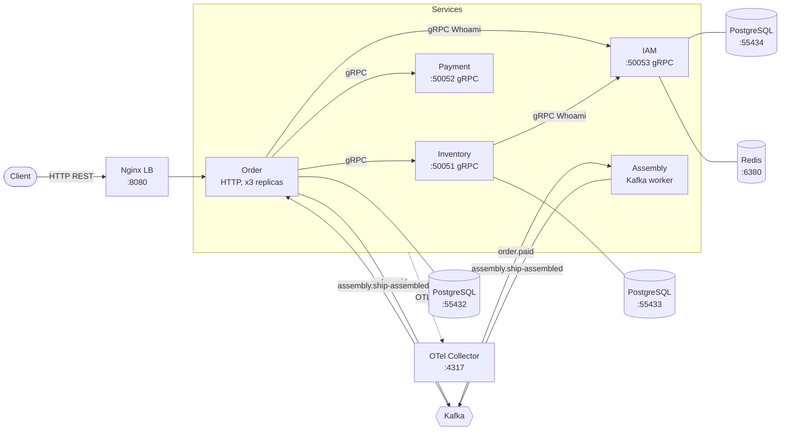

# Rocket Factory 🚀


A demo microservice project in Go: a spaceship assembly factory. A user registers, creates an
order from a set of parts and pays for it — after which the ship is assembled asynchronously
and the order status is updated through Kafka events.

The repository is a **Go workspace** (`go.work`) of independent modules: five services, a shared
platform library and the shared API contracts.

---

## What the project demonstrates

**Code architecture.** The layers `API → Service → Repository → Client` with separate models
(API / domain / storage) and converters between them. Dependency inversion: interfaces are
declared on the consumer side (`deps.go`) and implementations are supplied by a hand-written DI
container with lazy initialization and reverse-order resource shutdown.

**DDD.** Entities with behaviour rather than anaemic structs: `Reserve` / `Release` / `Commit`
never let a part reach an invalid state. Value objects for part properties, an "order + items"
aggregate with a single entry point, and a domain service that validates the compatibility of
hull, engine, shield and weapon. The domain layer knows nothing about the database or the logger.

**Data and consistency.** PostgreSQL through pgx with a connection pool, queries built with
Squirrel, migrations with goose. A transaction manager hides the transaction in the context, so
the repository does not know it is running inside one. Concurrent part reservation is guarded by
`SELECT ... FOR UPDATE` with a deterministic locking order (otherwise: deadlocks), and the
properties of the different part types live in JSONB instead of bloating the schema.

**Asynchrony.** Kafka (KRaft) as the event bus: `order.paid` → assembly → `assembly.ship-assembled`.
Consumer groups for horizontal scaling and idempotent handling, so a redelivery does not corrupt
the data.

**Authentication.** Passwords hashed with bcrypt, sessions in Redis with a TTL, a gRPC interceptor
and an HTTP middleware that validate the session, and the user identifier forwarded along the call
chain through gRPC metadata.

**Resilience.** A distributed rate limiter on Redis — one limit shared by every replica, and when
Redis is unavailable requests are let through instead of being blocked. Graceful shutdown,
healthchecks, and graceful degradation of telemetry: a broken Elasticsearch does not take the
service down.

**Observability.** OpenTelemetry across every service: structured logs (slog) written to stdout
and Elasticsearch at the same time, metrics in Prometheus with business dashboards in Grafana,
traces in Jaeger. A single `trace_id` links the records of every service, from order creation to
ship assembly.

**Testing and operations.** Table-driven unit tests with mocks (mockery) running in parallel, API
tests, concurrency and rate limiter tests, and e2e tests against a real Kafka through
testcontainers. Load testing with vegeta. The whole system — from the infrastructure to five
services behind Nginx — starts with a single command, and the images are built in multiple stages
with a BuildKit cache.

---

## Architecture



### Services

| Service       | Protocol        | Port  | Storage                    | Purpose                                                                     |
|---------------|-----------------|-------|----------------------------|-----------------------------------------------------------------------------|
| **order**     | HTTP (OpenAPI)  | 8080  | PostgreSQL `:55432`        | Creating, fetching, paying for and cancelling orders; orchestrates the rest  |
| **inventory** | gRPC            | 50051 | PostgreSQL `:55433`        | Part catalogue, compatibility checks, reserve/commit/release                 |
| **payment**   | gRPC            | 50052 | —                          | Processes the order payment                                                  |
| **iam**       | gRPC            | 50053 | PostgreSQL `:55434`, Redis | Registration, login, sessions, `Whoami` for the other services               |
| **assembly**  | Kafka consumer  | —     | —                          | Asynchronous ship assembly triggered by the payment event                    |

In container mode (`task up-all`) Order runs as three replicas behind Nginx on `:8080`, and the
incoming HTTP traffic is capped by a distributed rate limiter on Redis (`redis-ratelimit:6379`,
100 rps with a burst of 200 by default).

Supporting modules:

- **platform** — reusable infrastructure: logger, tracing, metrics, Kafka producer/consumer,
  Redis client, graceful shutdown (`closer`), gRPC health, auth context, middleware.
- **shared** — the contracts: `.proto` (gRPC), the OpenAPI spec of the Order API and the Go code
  generated from them.

### Business flow

1. `POST /api/v1/orders` — Order validates the session in IAM, checks part compatibility and
   reserves the parts in Inventory. The order enters `PENDING_PAYMENT`.
2. `POST /api/v1/orders/{uuid}/pay` — in a single transaction (with the order locked through
   `SELECT ... FOR UPDATE`) Order calls Payment, moves the order to `PAID` and publishes the
   `order.paid` event to Kafka.
3. **Assembly** consumes `order.paid`, assembles the ship and publishes `assembly.ship-assembled`.
4. The Order consumer reads `assembly.ship-assembled`, commits the part reservation in Inventory
   and moves the order to `ASSEMBLED` (idempotently — repeated messages are ignored).
5. `POST /api/v1/orders/{uuid}/cancel` — cancels the order and releases the reservation
   (`CANCELLED`).

Authentication is end-to-end: the client sends a session token, the Order middleware and the gRPC
interceptors forward it along the call chain, and every service validates the session through IAM.

---

## Stack

- **Go 1.26**, multi-module workspace
- **gRPC** + Protocol Buffers (`buf`, `protoc-gen-go`, `protoc-gen-go-grpc`)
- **OpenAPI 3** → Go code via [`ogen`](https://github.com/ogen-go/ogen)
- **PostgreSQL** + [`goose`](https://github.com/pressly/goose) migrations
- **Redis** — cache and IAM session storage, plus the distributed rate limiter of the Order API
- **Nginx** — HTTP load balancing across the OrderService replicas
- **Kafka** (KRaft, no ZooKeeper) — asynchronous events
- **OpenTelemetry** → OTel Collector → Jaeger (traces), Prometheus + Grafana (metrics),
  Elasticsearch + Kibana (logs)
- **Docker Compose** for the local infrastructure, **Task** ([go-task](https://taskfile.dev))
  instead of Make
- **mockery**, **testify**, **testcontainers** for testing; **vegeta** for load tests
- **golangci-lint**, **gofumpt**, **gci** for code quality

---

## Repository layout

```
.
├── assembly/          # assembly service (Kafka consumer + producer)
├── iam/               # authentication and user service
├── inventory/         # part catalogue service
├── order/             # order service (HTTP API, orchestrator)
├── payment/           # payment service
├── platform/pkg/      # shared infrastructure (logger, tracing, metrics, kafka, redis, closer...)
├── shared/
│   ├── proto/         # .proto contracts (auth, user, inventory, payment, events, common)
│   ├── api/           # OpenAPI spec of the Order API
│   └── pkg/           # generated Go code
├── migrations/        # SQL migrations per service (goose)
├── docs/              # engineering notes: why things are built the way they are
├── deploy/
│   ├── compose/       # docker-compose: core, observability, order, inventory, iam, services
│   ├── dockerfiles/   # service images + migrator.Dockerfile (goose)
│   ├── nginx/         # load balancer configuration in front of OrderService
│   ├── grafana/       # provisioning and dashboards
│   └── otel/          # OTel Collector configuration
├── .github/workflows/ # CI: build, lint, unit / api / e2e tests
└── Taskfile.yaml      # every project command
```

Every service follows the same layout:

```
<service>/
├── cmd/               # entry point
├── internal/
│   ├── app/           # application wiring and the DI container
│   ├── api/           # transport layer (gRPC / HTTP handlers) + converters
│   ├── service/       # business logic
│   ├── repository/    # data access + record ↔ model converters
│   ├── client/        # gRPC clients of the other services
│   ├── model/         # domain models
│   ├── config/        # configuration (env + yaml)
│   └── errors/        # domain errors
└── config.{local,staging,production}.yaml
```

The non-obvious technical decisions are written up in [docs/](docs/README.md) (in Russian): why the
transaction lives in the context, why `ORDER BY` is needed before `FOR UPDATE`, how the session
uuid travels through Kafka, what breaks without an Elasticsearch index template, and why the load
test hits several part pairs.

---

## Quick start

Requirements: Go 1.26+, Docker, [Task](https://taskfile.dev/installation/).

### Option 1 — everything in containers

```bash
task setup           # development tools (buf, ogen, golangci-lint, gofumpt, gci)
task hooks:install   # pre-commit hook: format + lint (once per clone)
task up-all          # core + observability + databases with migrations + services behind Nginx (order ×3)
```

`up-all` brings the databases up to healthy and runs the one-shot `migrator-*` containers (goose),
so the migrations apply themselves. Observability is prepared automatically inside `up-core`
(`observability:init`) as well: the log index template in Elasticsearch, the data view in Kibana
and the Jaeger wait — there is nothing left to run by hand after `up-all`.

### Option 2 — infrastructure in containers, services locally (development mode)

```bash
task setup
task up-infra        # Kafka + Kafka UI, observability, Redis, PostgreSQL of every service + migrations

# services — each in its own terminal or IDE run configuration
task run:iam         # :50053
task run:inventory   # :50051
task run:payment     # :50052
task run:order       # :8080
task run:assembly    # Kafka worker
```

`up-infra` starts everything except the services themselves: Nginx and the service containers stay
down, so ports `8080` and `50051`–`50053` remain free for local processes.

From an IDE a service runs as `go run ./cmd` with the working directory set to the service folder —
this matters because `main()` loads `<service>/<service>.env` relative to it, and the default config
comes from the neighbouring `config.local.yaml`. A different profile can be selected through
`CONFIG_PATH=config.staging.yaml` or the `-config` flag.

To stop: `task down-infra` (or `task down-all` if the containerized services were started too).

### Endpoints

| What                 | URL                                              |
|----------------------|--------------------------------------------------|
| Order API (behind Nginx) | http://localhost:8080/api/v1/orders          |
| Kafka UI             | http://localhost:8090                            |
| Jaeger (traces)      | http://localhost:16686                           |
| Grafana (metrics)    | http://localhost:3000 — `admin` / `admin`        |
| Prometheus           | http://localhost:9090                            |
| Kibana (logs)        | http://localhost:5601                            |
| Elasticsearch        | http://localhost:9200                            |

---

## Development commands

The full list is `task --list`.

### Code generation

```bash
task gen              # all generated code (proto + openapi)
task proto:gen        # Go code from .proto
task ogen:gen         # Go code from OpenAPI
task mocks:gen        # interface mocks (mockery)
```

### Code quality

```bash
task format           # gofumpt + gci
task lint             # golangci-lint
task build            # go build of every module
task hooks:install    # pre-commit hook: format + lint before committing
```

`task hooks:install` copies `scripts/pre-commit` into `.git/hooks/` and makes it executable
(without the executable bit git silently skips the hook). The `.git/hooks` directory is not
versioned, so every developer runs the command locally.

The hook formats only the Go files that are staged, puts them back into the index with `git add`
and runs `task lint` — a linter finding aborts the commit.

### Tests

```bash
task test             # unit tests with the race detector
task test:coverage    # business logic coverage (threshold: 40%)
task coverage:html    # HTML coverage report
task test:api         # API tests
task test:e2e         # order e2e against a real Kafka (Redpanda) via testcontainers
task load:http        # vegeta load test: 50 → 500 RPS, results land in Grafana
task load:seed        # create/replenish the load test parts (load:http calls it itself)
```

### Migrations

In `up-*` the migrations are applied by the `migrator-<service>` container (goose inside Docker).
These tasks are for running goose manually from the host:

```bash
task migrate:all:up                      # apply every migration of every service
task migrate:order:up                    # / :down / :status
task migrate:order:create -- <name>      # new migration file
```

The same applies to `inventory` and `iam`.

### Infrastructure

```bash
task up-core / down-core            # shared network, Kafka, observability, Redis rate limiter
task up-order / down-order          # PostgreSQL + Order migrations
task up-inventory / down-inventory
task up-iam / down-iam              # PostgreSQL + Redis + migrations
task up-all / down-all              # everything at once plus the containerized services behind Nginx
```

---

## Configuration

Configuration has two layers: a YAML file sets the baseline and environment variables override it
(`cleanenv`, priority **env > yaml > env-default**). The YAML path is resolved as
`-config` → `CONFIG_PATH` → `config.local.yaml`.

**The base layer is the YAML profiles** next to each service: `config.local.yaml` (running from the
host), `config.docker.yaml` (running in a container), `config.staging.yaml`, `config.production.yaml`.

**The override layer is the env files**, one per way of starting the service:

| File | Who reads it | What is inside |
|------|--------------|----------------|
| `<service>/<service>.env` | the service itself when run locally (`godotenv` in `cmd/main.go`) | host addresses: `localhost:50051`, `localhost:9092` |
| `<service>/<service>.docker.env` | the service container (`env_file` in `deploy/compose/services/`) | docker network addresses: `inventory-service:50051`, `kafka:29092` |
| `deploy/compose/<service>/compose.env` | `docker compose` only | PostgreSQL/Redis container settings and image versions |
| `core.env` (in the root) | `docker compose` and the `Taskfile` (through `dotenv`) | ports and images of the shared infrastructure, plus the `GO_IMAGE` / `ALPINE_IMAGE` / `GOOSE_VERSION` build args |

Splitting them by the way the service starts is mandatory: `<service>.env` holds host addresses, so
passing that file to a container would override `config.docker.yaml` and send the service to
`localhost` instead of the neighbouring container. The application never reads `compose.env`, and
`docker compose` never reads `<service>.env` — the layers do not overlap.

The `migrate:*` tasks take their credentials from `deploy/compose/<service>/compose.env` as well:
the goose DSN is assembled from `POSTGRES_*`, so goose and the database container cannot drift apart.

Keep the priority in mind: a change in `config.local.yaml` has no effect when the same variable is
set in `<service>/<service>.env` — env wins.

---

## CI

GitHub Actions (`.github/workflows/ci.yml`) runs `build`, `lint`, unit tests with coverage, API
tests and e2e tests on every PR.

The coverage badge at the top of this README works like this: after the unit tests the
`task coverage:badge` job builds `coverage/badge.json` in the
[shields.io endpoint](https://shields.io/badges/endpoint-badge) format, and on a push to `main` the
workflow writes it into a gist (this needs the `GIST_TOKEN` secret — a PAT with the `gist` scope).
The badge itself reads that gist through shields.io. To check the value and colour locally:
`task test:coverage && task coverage:badge`.

---

## License

[MIT](LICENSE)
